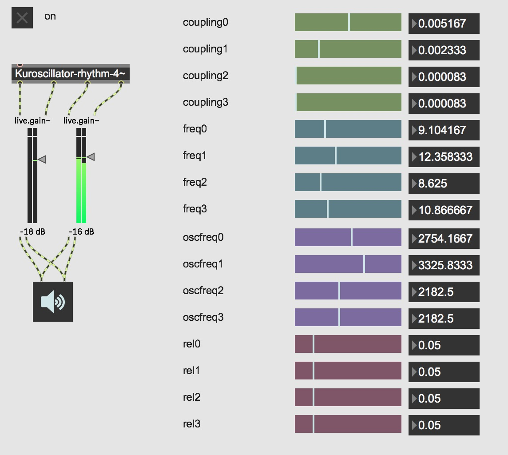

# Kuroscillators
MAX MSP objects for audio and rhythmic synthesis using coupled oscillator networks 

## What are coupled oscillators? 
Coupled Oscillators networks are dynamical systems that describe how ensembles of interacting elements are able to self-organize and synchronize 
over time. In terms of sensory perception, they have been examined in a wide range of fields including those related to rhythmic entrainment, biomusicology, psychoacoustics, signal processing, and generative music.

For more information, please see the paper located [here](https://www.nolanlem.com/pdfs/cmmr_2019-FINAL.pdf).
and/or a [video](https://vimeo.com/191720976) describing synchrony as an auditory percept. 

## Audio and Rhythmic Synthesis in MAX MSP

This object allows a user to perform real-time coupled oscillator audio synthesis using two sonifications schemes, *rhythmic* and *audio*. 
The max patch shown above is taken from the *./examples/* directory ("./examples/rhythm/simple-sync-rhythm.maxpat") and shows a *Kuroscillator-rhythm* object 
with 4 coupled oscillators in the ensemble. 

The Max MSP .mxo objects are located in the *./Kuroscillator-rhythm* and *./Kuroscillator-audio* directories. These directories contain 
the Max objects for each object respectively. Addtionally, within each directory there are subdirectories that contain max patches that contain 
all the coupling and frequency parameters pre-instantiated within a Max MSP environment (*./Kuroscillator-rhythm/max-patches/*). Lastly, each directory also contains the 
.dsp Faust code that contain the Faust generator files used to create the objects themselves (e.g. *./Kuroscillator-rhythm/audio-dsp/*). 

The .mxo files must be placed in the *./Library/externals/* directory within Max (or you must add the path 
where the .mxo objects are in 'File Preferences' within Max). As of now, this object has only been tested in Max 8.  

**INSTANTIATING OBJECTS**

The user can either use one of the pre-made code environments found within ./Kuroscillator-audio/max_patches/ or they can
create the object within Max using the following convention when creating a new object:

*Kuroscillator-[type]-[N]~*

where *[type]* is either 'rhythm' or 'audio' and *N* is the number of oscillators in the group (must be even and < 30). 

**MODEL PARAMETERS: INTERACTING WITH THE OSCILLATORS**

The user can directly modify the coupling coefficients and intrinsic frequency of the Kuroscillator-audio object by sending max messages of the 
following format to the object itself: 

./Kuroscillator-audio/coupling[i]  $1 
./Kuroscillator-audio/frequency[i]  $1

where [i] is a specific oscillator in the group.    

For the Kuroscillator-rhythm object, users can also address the following:

./Kuroscillator-rhythm/oscfreq[i]  $1
./Kuroscillator-audio/rel[i]  $1 

where *oscfreq* is the audio frequency of the audio event that gets triggered each oscillator's cycle (at each zero crossing) and 'rel' is
the release of the ASR envelope that gets applied to the sound trigger. 

The *./examples/* directory contains a few presets that highlight several potential uses of the objects as they pertain to different synchronous system states 
and how they might generate interesting sonic phenomena.  
